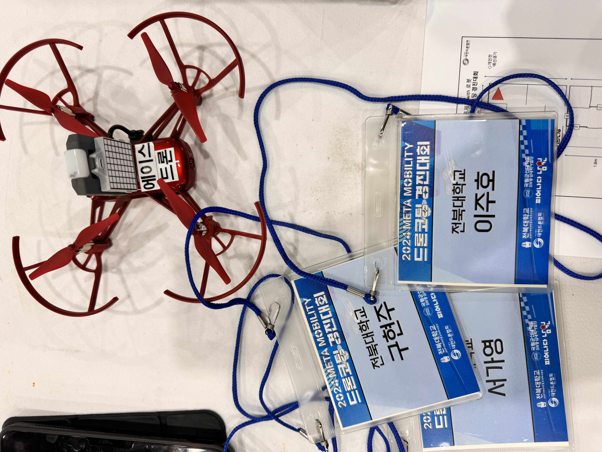

2024 METE MOBILITY 드론코딩 경진대회에 참여하였습니다.
9월 20일~9월22일 3일간 교육을 수료하였고 10월 3일 대회에 출전하여 
"장애물 코스 자율주행 드론"을 프로그래밍하여 통과하는 미션을 수행하였습니다

링크: [대회 공지](https://eei.chonbuk.ac.kr/bbs/eei/4404/338337/artclView.do)
