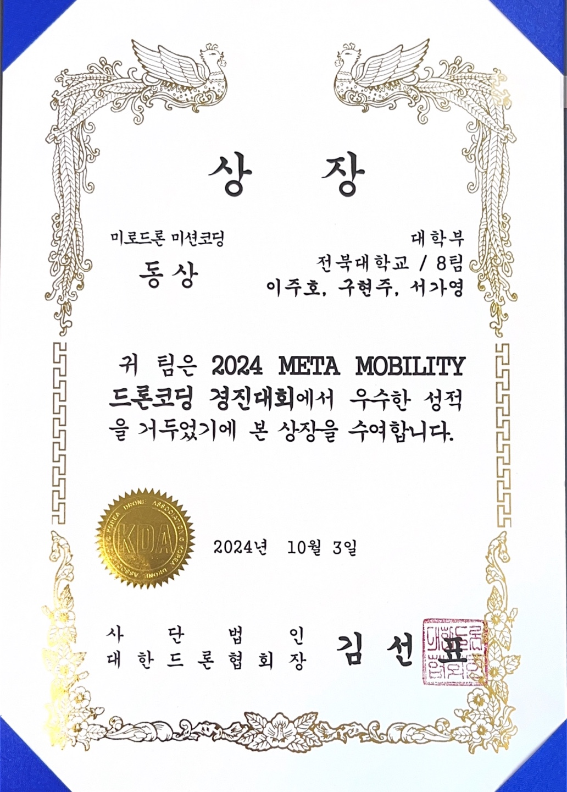

I participated in the **2024 METE MOBILITY Drone Coding Competition**.  
After completing a 3-day training program from **September 20 to 22**, I competed on **October 3**, where our team programmed an **autonomous drone** capable of navigating and completing an **obstacle course** mission.  
We successfully completed the task and received the **Bronze Award**.

  
  
  
  
  
  
  
  
  
  

🔗 **Link:** [Official Competition Announcement](https://eei.chonbuk.ac.kr/bbs/eei/4404/338337/artclView.do)
