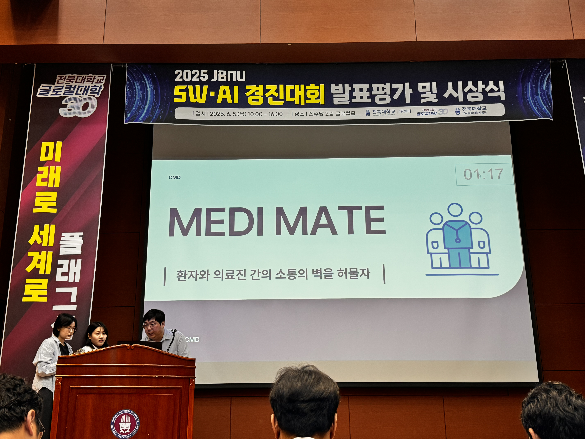

Participated in the **2025 JBNU SW/AI Competition** under the **Software Division (Major Team)** category.  
Our project, **“MEDI MATE,”** focused on developing software that leverages **generative AI** to address real-world social problems.  
We successfully presented the project and received the **Silver Award**.

  
  

🔗 **Related Link:** [Official Competition Page](https://csai.jbnu.ac.kr/bbs/csai/5289/355730/artclView.do)
